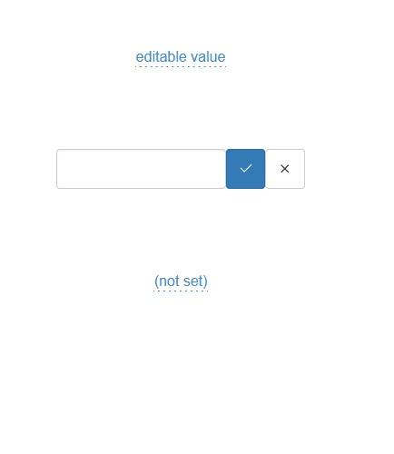

# Editable column 

[](https://dependabot.com/)

```html

<editable-input display-value="(set...)" :inputs="{modelid:121,isEditable:1}" value='6900' input-name='price' url='/path/to/update'/>

```

`url` url for updating column

`input-name` name of editable input for form

`inputs` object of additional form data

`value` value of column, if value is object

`options` if is object then, select is created

`display-value` what to show if value is empty, default is _(not-set)_

`default-show-input` whether to show input on load, default is _false_


